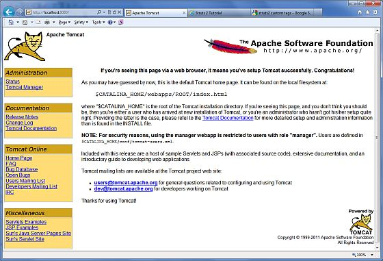

# Servlets——环境设置

开发环境是你开发你的 Servlet，测试它们并最终运行它们的地方。

和任何其他的 Java 程序一样，你需要通过使用 Java 编译器 **javac** 来编译 servlet，并且在编译 servlet 应用程序后，它将会被部署在配置的环境中来测试和运行。

这个开发环境设置包括以下步骤：

## 设置 Java 开发工具包

这一步涉及到下载 Java 软件开发工具包（SDK），并正确的设置 PATH 环境变量。

你可以从 Oracle 的 Java 网站：[Java SE Downloads]( http://www.oracle.com/technetwork/java/javase/downloads/index.html) 下载 SDK。

当你下载了你的 Java 实现后，按照给定的指令来安装和配置设置。最后，设置 PATH 和 JAVA _ HOME 环境变量来与包含 java 和 javac 的目录相关联，通常分别为 java _ install _ dir / bin 和 java _ install _ dir。

如果你运行的是 Windows 操作系统且 SDK 安装在 C:\jdk1.5.0_20 中，那么在你的 C:\autoexec.bat 文件中放入下列的行：

``` 
set PATH=C:\jdk1.5.0_20\bin;%PATH%
set JAVA_HOME=C:\jdk1.5.0_20
```

或者，在 Windows NT/2000/XP 操作系统中，你也可以用鼠标右键单击“我的电脑”，选择“属性”，再选择“高级”，“环境变量”。然后，更新 PATH 值，按下 “OK” 按钮。

在 Unix（Solaris、Linux 等）操作系统中，如果 SDK 安装在 /usr/local/jdk1.5.0_20 中，并且你使用的是 C shell，则在你的 .cshrc 文件中放入下列的行：

``` 
setenv PATH /usr/local/jdk1.5.0_20/bin:$PATH
setenv JAVA_HOME /usr/local/jdk1.5.0_20
```

另外，如果你使用一个集成的开发环境（IDE），比如 Borland JBuilder、Eclipse、IntelliJ IDEA 或 Sun ONE Studio，编译并运行一个简单的程序，以确认该 IDE 知道你把 Java 安装在哪里。

## 设置 Web 服务器：Tomcat

市场上有许多 Web 服务器支持 servlets。有些 web 服务器是免费下载的，Tomcat 就是其中的一个。

Apache Tomcat 是 Java Servlet 和 JavaServer Pages 技术的开源软件实现，可以作为测试 servlets 的独立服务器，而且可以用 Apache Web 服务器集成。下面是在你的电脑上安装 Tomcat 的步骤：

- 从 [http://tomcat.apache.org/](http://tomcat.apache.org/) 上下载最新版本的 Tomcat。

- 一旦你下载了 Tomcat，将该二进制发布包解压缩到一个方便的位置。例如，如果你使用的是 Windows操作系统，则解压缩到 C:\apache-tomcat-5.5.29 中，如果你使用的是 Linux/Unix 操作系统，则解压缩到 /usr/local/apache-tomcat-5.5.29 中，并创建指向这些位置的 CATALINA_HOME 环境变量。

在 Windows 操作系统的计算机上，可以通过执行下述命令来启动 Tomcat：

``` 
%CATALINA_HOME%\bin\startup.bat
 or
 C:\apache-tomcat-5.5.29\bin\startup.bat
```

在 Unix（Solaris、Linux 等）操作系统的计算机上，可以通过执行下述命令来启动 Tomcat：

``` 
$CATALINA_HOME/bin/startup.sh
or
/usr/local/apache-tomcat-5.5.29/bin/startup.sh
```

Tomcat 启动后，通过访问 **http://localhost:8080/**，Tomcat 包含的默认 web 应用程序会变得可用。如果一切顺利，那么会显示如下所示结果：



有关配置和运行 Tomcat 的更多信息可以查阅这里包含的文档，也可以访问 Tomcat 网站：http://tomcat.apache.org。

在 Windows 操作系统的计算机上，可以通过执行下面的命令来停止 Tomcat：

``` 
C:\apache-tomcat-5.5.29\bin\shutdown
```

在 Unix（Solaris、Linux 等）操作系统的计算机上，可以通过执行下面的命令来停止 Tomcat：

``` 
/usr/local/apache-tomcat-5.5.29/bin/shutdown.sh
```

## 设置 CLASSPATH

由于 servlets 不是 Java 平台标准版的组成部分，所以你必须为编译器指定 servlet 类。

如果你运行的是 Windows 操作系统，则需要在你的 C:\autoexec.bat 文件中放入下列的行：

``` 
set CATALINA=C:\apache-tomcat-5.5.29
set CLASSPATH=%CATALINA%\common\lib\servlet-api.jar;%CLASSPATH%
```

或者，在 Windows NT/2000/XP 操作系统中，你也可以用鼠标右键单击“我的电脑”，选择“属性”，再选择“高级”，“环境变量”。然后，更新 CLASSPATH 的值，按下“OK”按钮。

在 Unix（Solaris、Linux 等）操作系统中，如果你使用的是 C shell，则需要在你的 .cshrc 文件中放入下列的行：

``` 
setenv CATALINA=/usr/local/apache-tomcat-5.5.29
setenv CLASSPATH $CATALINA/common/lib/servlet-api.jar:$CLASSPATH
```

**注意：**假设你的开发目录是 C:\ServletDevel（Windows 操作系统中）或 /user/ServletDevel（UNIX 操作系统中），那么你还需要在 CLASSPATH 中添加这些目录，添加方式与上面的添加方式类似。
