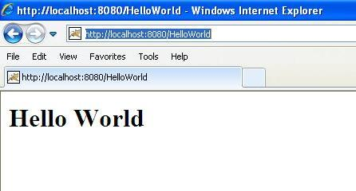

# Servlets——实例

Servlets 是 Java 类，服务于 HTTP 请求并实现了 **javax.servlet.Servlet** 接口。Web 应用程序开发人员通常编写扩展 javax.servlet.http.HttpServlet 的 servlets，它是一个实现了 Servlet 接口的抽象类并且是为处理 HTTP 请求专门设计的。

## Hello World 的示例代码：

下面是 servlet 编写 Hello World 的示例源代码：

``` 
// Import required java libraries
import java.io.*;
import javax.servlet.*;
import javax.servlet.http.*;
// Extend HttpServlet class
public class HelloWorld extends HttpServlet {
  private String message;
  public void init() throws ServletException
  {
      // Do required initialization
      message = "Hello World";
  }
  public void doGet(HttpServletRequest request,
                    HttpServletResponse response)
            throws ServletException, IOException
  {
      // Set response content type
      response.setContentType("text/html");
      // Actual logic goes here.
      PrintWriter out = response.getWriter();
      out.println("<h1>" + message + "</h1>");
  }  
  public void destroy()
  {
      // do nothing.
  }
}
```

## 编译 Servlet：

让我们把上述代码放入 HelloWorld.java 文件中，并把这个文件放在 C:\ServletDevel（Windows 操作系统中）或 /usr/ServletDevel（UNIX 操作系统中）中，然后你需要将这些目录添加到 CLASSPATH 中。

假设你的环境已经正确地设置，进入 **ServletDevel** 目录，并编译 HelloWorld.java，如下所示：

``` 
$ javac HelloWorld.java
```

如果 servlet 依赖于任何其他库，你必须还要在 CLASSPATH 中包含那些 JAR 文件。我只包含了 servlet-api.jar JAR 文件，因为我在 Hello World 程序中没有使用任何其他库。

该命令行使用了来自 Sun Microsystems Java 软件开发工具包（JDK）的内置的 javac 编译器。为使该命令正常工作，你必须包含在 PATH 环境变量中使用的 Java SDK 的位置。

如果一切顺利，上述编译会在相同的目录中产生 **HelloWorld.class** 文件。下一节将解释在生产中如何部署一个已编译的 servlet 。

## Servlet 部署：

默认情况下，servlet 应用程序是位于路径 <Tomcat-installation-directory>/webapps/ROOT 中的，且类文件放在 <Tomcat-installation-directory>/webapps/ROOT/WEB-INF/classes 中。

如果你有一个完全合格的 **com.myorg.MyServlet** 的类名称，那么这个 servlet 类必须被放置在 WEB-INF/classes/com/myorg/MyServlet.class 中。

现在，让我们把 HelloWorld.class 复制到 <Tomcat-installation-directory>/webapps/ROOT/WEB-INF/classes 中，并在位于 <Tomcat-installation-directory>/webapps/ROOT/WEB-INF/ 的 **web.xml** 文件中创建以下条目：

``` 
<servlet>
   <servlet-name>HelloWorld</servlet-name>
   <servlet-class>HelloWorld</servlet-class>
</servlet>
<servlet-mapping>
   <servlet-name>HelloWorld</servlet-name>
   <url-pattern>/HelloWorld</url-pattern>
</servlet-mapping>
```

上面的条目要被创建在 web.xml 文件中可用的 <web-app>...</web-app> 标签内。在这个表中可能已经存在各种可用的条目，但没有关系。

你基本上已经完成了，现在让我们使用 <Tomcat-installation-directory>\bin\startup.bat（Windows 操作系统中）或 <Tomcat-installation-directory>/bin/startup.sh（Linux/Solaris 等操作系统中）启动 tomcat 服务器，最后在浏览器的地址栏中输入 **http://localhost:8080/HelloWorld**。如果一切顺利，你会看到下面的结果：

