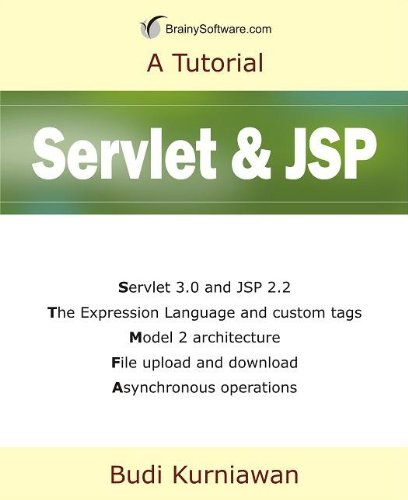

# Servlets——有用的资源

下面的资源包含 Servlet 的其他信息。请使用它们来对这一主题获得深入的了解。 

- [Sun's Site on Servlets](http://java.sun.com/products/servlet/)——Sun 的官方网站提供的 Servlet 资料链接。

- [JSP Engine - Tomcat](http://tomcat.apache.org/)——Apache Tomcat 是一个实现 Java Servlet 和 JavaServer Pages 技术的开源软件。

- [MySQL Connector/J](http://dev.mysql.com/downloads/connector/j/5.1.html)——MySQL Connector/J 是 MySQL 的官方 JDBC 驱动程序.

- [The JavaTM Tutorials](http://java.sun.com/docs/books/tutorial/index.html)——The Java Tutorials 是给想要使用 Java 编程语言编写应用程序的程序员的实用手册。

- [JavaTM 2 SDK, Standard Edition](http://java.sun.com/j2se/1.4.2/docs/index.html)——JavaTM 2 SDK（标准版）的官方网址。

- [Free Java Download](http://www.java.com/en/download/index.jsp)——现在下载 Java 到你的桌面！

- [Sun Developer Network](http://java.sun.com/reference/docs/)——Sun Microsystem 的官方网址，其中列出了所有的 API 文档，最新的 Java 技术、书籍或者其他资源。 

## 关于 Java servlet 的有用的书籍

<ul id="books">
<li>
</li>
<li>
</li>
<li>
</li>
<li>
</li>
<li>
</li>
<li>
</li>
</ul>
